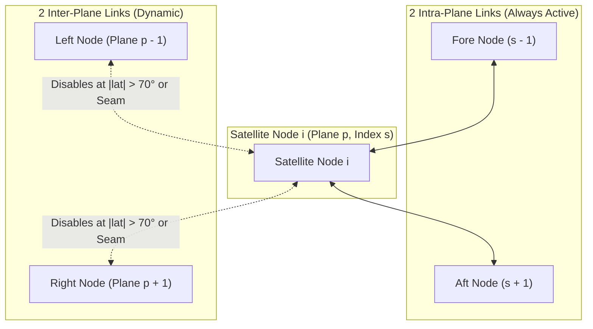

# LEO Satellite Network Constellation & ISL Graph Topology

## Executive Summary
This document provides a technical specification of the constellation geometry, orbital parameters, dynamic Inter-Satellite Link (ISL) topology, and physical constraints implemented in the **100-Satellite LEO Dynamic Routing System**.

The topology models a 100-satellite **Walker-Delta LEO constellation** operating at an altitude of 550 km with an inclination of 53°. Dynamic ISL graph maintenance incorporates line-of-sight (LOS) Earth occlusion checks, maximum transmission ranges, polar region link shutdowns ($|\text{lat}| > 70^\circ$), and counter-rotating seam link disabling.

---

## 1. Walker-Delta Constellation Geometry

The constellation follows standard Walker-Delta notation: **`53°: 100/10/1`**

```
                     ┌───────────────────────────────────────────┐
                     │    Walker-Delta LEO Constellation         │
                     │    100 Satellites / 10 Planes / 53° Inc   │
                     └─────────────────────┬─────────────────────┘
                                           │
         ┌─────────────────────────────────┼─────────────────────────────────┐
         ▼                                 ▼                                 ▼
┌──────────────────┐             ┌──────────────────┐             ┌──────────────────┐
│ Orbital Plane 0  │             │ Orbital Plane 1  │             │ Orbital Plane 9  │
│  Satellites 0-9  │  ⋯ ⋯ ⋯ ⋯ ⋯  │ Satellites 10-19 │  ⋯ ⋯ ⋯ ⋯ ⋯  │ Satellites 90-99 │
└──────────────────┘             └──────────────────┘             └──────────────────┘
```

### Constellation Orbital Parameters

| Parameter | Notation | Value | Units | Description |
| :--- | :---: | :---: | :---: | :--- |
| **Total Satellites** | $N$ | **100** | Count | Total active satellite nodes (IDs $0 \dots 99$) |
| **Orbital Planes** | $P$ | **10** | Planes | Distributed evenly in Right Ascension of Ascending Node (RAAN) |
| **Satellites per Plane** | $S$ | **10** | Count | $S = N / P = 100 / 10 = 10$ satellites per plane |
| **Orbital Altitude** | $h$ | **550.0** | km | Low Earth Orbit (LEO) operational altitude |
| **Orbital Inclination** | $i$ | **53.0°** | degrees | Inclined orbit coverage ($53.0^\circ$) |
| **Phasing Factor** | $F$ | **1** | Factor | Relative phase shift between adjacent orbital planes |
| **Eccentricity** | $e$ | **0.0** | dimensionless | Circular orbit assumption |
| **Semi-Major Axis** | $a$ | **6,928.137** | km | $a = R_{\text{Earth}} + h = 6,378.137 + 550.0$ |
| **Earth Radius** | $R_{\text{Earth}}$ | **6,378.137** | km | WGS-84 Equatorial Earth Radius |
| **Orbital Period** | $T_{\text{orbit}}$ | **95.6** | minutes | ~5,736 seconds per complete orbit |
| **Orbital Propagator** | — | **SGP4 / Keplerian** | Model | Analytical Keplerian & SGP4 SDP4 perturbation models |

---

## 2. Satellite Node Indexing & Coordinate System

### Node Indexing Mapping
Each satellite ID $k \in \{0, \dots, 99\}$ maps deterministically to its orbital plane $p \in \{0, \dots, 9\}$ and index within the plane $s \in \{0, \dots, 9\}$:

$$p = \lfloor k / 10 \rfloor, \quad s = k \pmod{10}$$

$$\text{Satellite ID } k = p \times 10 + s$$

### Reference Coordinate Frames
1. **ECI Frame (Earth-Centered Inertial)**: Non-rotating frame $(X_{\text{ECI}}, Y_{\text{ECI}}, Z_{\text{ECI}})$ used for Keplerian/SGP4 orbit propagation and distance computations.
2. **ECEF Frame (Earth-Centered Earth-Fixed)**: Rotating Earth frame $(X_{\text{ECEF}}, Y_{\text{ECEF}}, Z_{\text{ECEF}})$ used for ground station visibility and geographic traffic mapping.

---

## 3. Dynamic Inter-Satellite Link (ISL) Grid Topology

Each satellite is equipped with **4 optical transceivers** (max degree $d \le 4$), forming a dynamic 2D torus-like grid graph.



### A. Intra-Plane ISLs (2 Links per Satellite)
- Connects adjacent satellites along the **same orbital plane**:
  - Fore Link: Satellite $k \longleftrightarrow (p \times 10 + (s - 1) \pmod{10})$
  - Aft Link: Satellite $k \longleftrightarrow (p \times 10 + (s + 1) \pmod{10})$
- **Status**: **Always Active** (constant relative distance and near-zero Doppler shift).

### B. Inter-Plane ISLs (2 Links per Satellite)
- Connects satellites in **adjacent orbital planes**:
  - Left Link: Plane $p \longleftrightarrow Plane \; (p - 1) \pmod{10}$
  - Right Link: Plane $p \longleftrightarrow Plane \; (p + 1) \pmod{10}$
- **Status**: **Dynamic** (subject to Polar and Seam link disabling rules).

---

## 4. Physical ISL Constraints & Disabling Rules

### 1. Max Transmission Range Constraint
- Maximum allowable link distance: **$D_{\text{max}} = 5,000.0\text{ km}$**
- Links exceeding $5,000.0\text{ km}$ cannot be maintained due to free-space path loss and optical power limitations.

### 2. Line-of-Sight (LOS) & Atmospheric Clearance
- To prevent laser beam occlusion by the Earth or atmospheric distortion, line-of-sight must clear an **80.0 km atmospheric buffer**:
  $$R_{\text{clearance}} = R_{\text{Earth}} + 80.0\text{ km} = 6,458.137\text{ km}$$
- For link between $\vec{r}_1$ and $\vec{r}_2$, closest point of approach to origin $\vec{r}_{\text{min}}$ must satisfy:
  $$\|\vec{r}_{\text{min}}\| \ge R_{\text{clearance}}$$

### 3. Polar Link Disabling Rule ($|\text{latitude}| > 70.0^\circ$)
- Near polar regions, adjacent orbital planes converge rapidly, causing high slewing rates and extreme Doppler shifts for optical transceivers.
- **Rule**: Inter-plane ISLs are **automatically disabled** whenever a satellite's latitude exceeds $70.0^\circ$:
  $$\text{If } |\phi| > 70.0^\circ \implies \text{Disable Inter-Plane ISLs}$$

### 4. Counter-Rotating Seam Disabling Rule
- In Walker-Delta constellations, satellites in Plane 9 and Plane 0 move in opposite relative directions across the orbital "seam".
- **Rule**: Inter-plane links between **Plane 9 and Plane 0 are strictly disabled**:
  $$\text{Inter-Plane Links } (p=9 \longleftrightarrow p=0) = \text{DISABLED}$$

---

## 5. Graph Topology Metrics

Across all 13 canonical simulation scenarios ($720$ timesteps per scenario), the graph structure exhibits the following consistent metrics:

| Graph Metric | Value | Description |
| :--- | :---: | :--- |
| **Total Graph Nodes ($V$)** | **100** | Satellites (IDs $0 \dots 99$) |
| **Active ISL Edges ($E$)** | **380** | Active bidirectional links per snapshot |
| **PyG Directed Edge Indices** | **760** | Shape `[2, 760]` in PyTorch Geometric `Data.edge_index` |
| **Average Node Degree** | **7.6** | $2 \times 380 / 100 = 7.6$ (varies dynamically between 2 and 4 per node) |
| **Graph Diameter** | **10 - 12** | Maximum shortest path hop distance across constellation |
| **Dynamic Snapshots** | **9,360** | 720 snapshots $\times$ 13 scenarios saved as `.pt` PyG payloads |

---

## 6. Graph Feature Representation in Spatial GAT (8+4 Architecture)

In PyTorch Geometric (`torch_geometric.data.Data`), each snapshot `snapshot_XXXX.pt` encodes this topology into:

1. **`x` Matrix `[100, 8]`**: 8 non-target physical node state features (`pos_eci_x,y,z`, `vel_eci_x,y,z`, `buffer_utilization`, `degree`).
2. **`edge_index` Matrix `[2, 380]`**: Node connection pairs $(i, j)$ for the 380 active ISLs.
3. **`edge_attr` Matrix `[380, 4]`**: 4 dynamic physical link attributes (`distance_km`, `delay_ms`, `link_utilization`, `link_failure_probability`).
