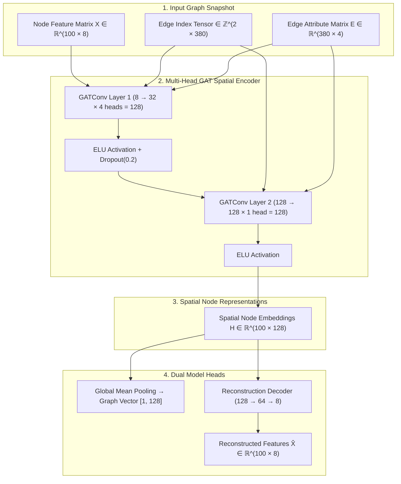

# Spatial/Topological Graph Attention Network (GAT) Architecture Specification

## Executive Summary
This document provides a comprehensive technical specification of the **Spatial/Topological Graph Attention Network (GAT)** architecture implemented in the **100-Satellite LEO Constellation Dynamic Routing System**.

The GAT model functions as a pure self-supervised spatial and topological representation learner using the **8-Node / 4-Edge Physical Architecture**. It encodes 100 3D orbital satellite state vectors (position, velocity, buffer utilization, degree) and 380 dynamic Inter-Satellite Link (ISL) graph edges (distance, delay, utilization, failure probability) into 128-dimensional spatial node embeddings $H \in \mathbb{R}^{100 \times 128}$ without target leakage.

---

## 1. High-Level GAT Module Architecture



---

## 2. Layer-by-Layer Architectural Breakdown

The model `LEOGATModel` is defined in [`satsim/gat/gat_model.py`](file:///c:/projects/Final%20year%20project%202/satsim/gat/gat_model.py):

| Layer / Component | Type | Input Shape | Output Shape | Parameters / Details |
| :--- | :---: | :---: | :---: | :--- |
| **Input Node Tensor** | Input | — | `[100, 8]` | 8 non-target physical satellite state features (`pos_eci_x,y,z`, `vel_eci_x,y,z`, `buffer_util`, `degree`) |
| **Input Edge Index** | Input | — | `[2, 380]` | Source & target IDs for 380 active ISLs |
| **Input Edge Attributes** | Input | — | `[380, 4]` | 4 physical ISL link attributes (`distance_km`, `delay_ms`, `link_util`, `link_fail_prob`) |
| **GAT Layer 1** | `GATConv` | `[100, 8]` | `[100, 128]` | `in=8`, `out=32`, `heads=4`, `concat=True`, `edge_dim=4` |
| **Activation 1** | `ELU` | `[100, 128]` | `[100, 128]` | Exponential Linear Unit ($\alpha = 1.0$) + `Dropout(0.2)` |
| **GAT Layer 2** | `GATConv` | `[100, 128]` | `[100, 128]` | `in=128`, `out=128`, `heads=1`, `concat=False`, `edge_dim=4` |
| **Activation 2** | `ELU` | `[100, 128]` | `[100, 128]` | Output: **Spatial Node Embedding Matrix $H \in \mathbb{R}^{100 \times 128}$** |
| **Global Pool Head** | `global_mean_pool` | `[100, 128]` | `[1, 128]` | Constellation-wide global graph embedding |
| **Decoder Hidden** | `Linear` | `[100, 128]` | `[100, 64]` | Weight: $[128, 64]$, Bias: $[64]$ + `ELU` + `Dropout(0.2)` |
| **Decoder Output** | `Linear` | `[100, 64]` | `[100, 8]` | Weight: $[64, 8]$, Bias: $[8]$ $\to$ Reconstructed $\hat{X}$ |

---

## 3. Mathematical Formulation of Graph Attention

### Edge-Conditioned Multi-Head Attention
For a target satellite node $i$ and its neighbor $j \in \mathcal{N}(i)$ connected via ISL edge $e_{ij} \in \mathbb{R}^4$:

1. **Linear Feature Projection**:
   $$h_i^{(k)} = W^{(k)} x_i, \quad W^{(k)} \in \mathbb{R}^{F_{\text{out}} \times 8}$$

2. **Edge Feature Projection**:
   $$e_{ij}' = W_e^{(k)} e_{ij}, \quad W_e^{(k)} \in \mathbb{R}^{F_{\text{out}} \times 4}$$

3. **Attention Coefficients Calculation**:
   $$\alpha_{ij}^{(k)} = \frac{\exp\left(\text{LeakyReLU}\left(\mathbf{a}^{(k)\top} \left[ h_i^{(k)} \,||\, h_j^{(k)} \,||\, e_{ij}' \right]\right)\right)}{\sum_{l \in \mathcal{N}(i)} \exp\left(\text{LeakyReLU}\left(\mathbf{a}^{(k)\top} \left[ h_i^{(k)} \,||\, h_l^{(k)} \,||\, e_{il}' \right]\right)\right)}$$

4. **Multi-Head Aggregation (Layer 1)**:
   $$h_i' = \overset{K}{\underset{k=1}{\parallel}} \sigma \left( \sum_{j \in \mathcal{N}(i)} \alpha_{ij}^{(k)} W^{(k)} x_j \right), \quad K = 4 \text{ heads}$$

5. **Single-Head Aggregation (Layer 2 - Output Embedding)**:
   $$H_i = \sigma \left( \sum_{j \in \mathcal{N}(i)} \alpha_{ij} W h_j' \right) \in \mathbb{R}^{128}$$

---

## 4. Self-Supervised Objective & Training Protocol

### Target-Free Reconstruction Objective
The GAT is trained to reconstruct its own standardized input feature matrix $X_{\text{scaled}} \in \mathbb{R}^{100 \times 8}$:

$$\mathcal{L}_{\text{reconstruction}} = \frac{1}{N \cdot F} \sum_{i=1}^{100} \sum_{j=1}^{8} \left( \hat{X}_{i, j} - X_{\text{scaled}, i, j} \right)^2$$

### Hyperparameters & Optimization
- **Optimizer**: Adam ($\text{lr} = 0.001$, $\text{weight\_decay} = 10^{-4}$)
- **LR Scheduler**: `ReduceLROnPlateau` ($\text{mode}=\text{'min'}$, $\text{factor}=0.5$, $\text{patience}=3$, min lr = $1.25 \times 10^{-4}$)
- **Epochs**: 50 epochs ($\text{seed} = 42$)
- **Batch Size**: 32 graph snapshots per batch

---

## 5. Quantitative Metrics & Loss Gap Diagnosis

### Standardized Reconstruction Performance (8+4 Architecture)
- **Overall $R^2$ (Variance-Weighted)**: **`99.21%`** (`0.992118`)
- **Validation Reconstruction MSE**: **`0.007803`** (MAE: `0.041248`)
- **Test Reconstruction MSE**: **`0.007820`** (MAE: `0.041289`)

### Train/Eval Loss Gap Diagnosis
```
============================================================
EMPIRICAL TRAIN/VAL LOSS GAP DIAGNOSTIC REPORT
============================================================
Train Loss (train() mode, with dropout): 0.067767
Train Loss (eval() mode, no dropout):   0.009995
Val Loss   (eval() mode, no dropout):   0.007851
Dropout Impact Ratio (train/eval):      6.78x
True Train/Val Gap in eval() mode:      0.002144
============================================================
```

- **Finding**: `nn.Dropout(0.2)` inflates training loss by **6.78x** during `model.train()` mode. When evaluated deterministically under `model.eval()`, the true generalization gap between Train ($0.009995$) and Val ($0.007851$) is only **$0.002144$**.

---

## 6. Exported Spatial Embeddings Payload Schema

The GAT outputs **9,360 spatial embedding payload files** (`embedding_000000.pt` ... `embedding_009359.pt`) saved in [`artifacts/gat/spatial/embeddings/`](file:///c:/projects/Final%20year%20project%202/artifacts/gat/spatial/embeddings):

```python
payload = {
    "scenario": "low_load",         # Scenario string identifier
    "seed": 42,                     # Global random seed
    "timestep": 0,                  # Timestep integer (0..719)
    "satellite_ids": [0, 1, ..., 99], # List of satellite node IDs
    "node_embeddings": Tensor,     # Shape [100, 128] (Spatial node vectors)
}
```

- **Validation Assertions**: `node_embeddings.shape == (100, 128)`, `torch.isnan(node_embeddings).sum() == 0`.
