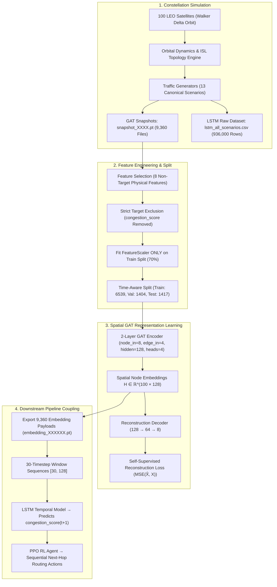

# LEO Satellite Network Workflow: Simulation to GAT Spatial Representation Learning

## Executive Summary
This document provides a comprehensive technical reference for the complete data generation, feature engineering, and GAT representation learning pipeline implemented in the **100-Satellite LEO Dynamic Routing Project**. 

The workflow spans from orbital simulation across 13 canonical traffic scenarios to the self-supervised training of a **Spatial/Topological Graph Attention Network (GAT)** that extracts 128-dimensional spatial satellite node embeddings for downstream LSTM future congestion prediction and PPO reinforcement learning routing.

---

## 1. End-to-End System Architecture



---

## 2. Orbital Simulation & Dataset Generation

### Constellation & Simulation Parameters
- **Constellation Topology**: 100 LEO satellites in a Walker Delta constellation (IDs `0` to `99`).
- **Inter-Satellite Links (ISLs)**: 4 dynamic ISLs per satellite (2 intra-plane, 2 inter-plane), yielding **380 graph edges** per snapshot.
- **Simulation Duration**: 720 timesteps per scenario ($t = 0 \dots 719$).

### Canonical Traffic & Environmental Scenarios (13 Scenarios)
The simulation generates synthetic network dynamics across 13 distinct operational regimes:
1. `low_load`: Baseline sparse traffic.
2. `medium_load`: Standard nominal operational load.
3. `high_load`: Elevated constellation traffic.
4. `peak_load`: Near-capacity network stress.
5. `burst`: High-amplitude transient traffic surges.
6. `flash_crowd`: Sudden localized packet flooding.
7. `hotspot`: Geographic traffic concentration.
8. `random_traffic`: Stochastic packet generation.
9. `self_similar`: Heavy-tailed Pareto traffic distributions.
10. `mixed`: Combined multi-modal traffic patterns.
11. `failures`: Sudden ISL / satellite node outages.
12. `weather`: Atmospheric & ground station attenuation.
13. `congestion_stress`: Sustained extreme network overload.

### Generated Dataset Artifacts

| Dataset Artifact | File Format | Total Snapshots/Rows | Primary Contents |
| :--- | :---: | :---: | :--- |
| **GAT Graph Snapshots** | `.pt` (PyG `Data`) | **9,360 files** (720 timesteps $\times$ 13 scenarios) | Graph structure `edge_index` $[2, 380]$, edge attributes `edge_attr` $[380, 4]$, and 8 node features `x` $[100, 8]$. |
| **Consolidated Raw LSTM Dataset** | `.csv` / `.parquet` | **936,000 rows** ($100 \times 13 \times 720$) | Single source-of-truth table indexed by `(scenario, seed, satellite_id, timestep)`. |

---

## 3. Feature Selection & Target Leakage Prevention

### Streamlined 8-Node / 4-Edge Physical Architecture Schema
Each satellite node state is represented by 8 non-redundant physical variables to prevent collinearity and eliminate target leakage:

1. **Excluded Target Variable**: `congestion_score` (column index 13) is **strictly excluded** from GAT input $X(t)$.
2. **Eliminated Collinear Replicas**: Dropped redundant coordinate variants (`pos_ecef`), raw queue counts (`queue_length`), and static flags.

### 8 Input Features for Spatial Representation Learning

$$\text{FEATURE\_INDICES} = [0, 1, 2, 3, 4, 5, 10, 12]$$

1. `pos_eci_x`: Earth-Centered Inertial position X (km).
2. `pos_eci_y`: Earth-Centered Inertial position Y (km).
3. `pos_eci_z`: Earth-Centered Inertial position Z (km).
4. `vel_eci_x`: Earth-Centered Inertial velocity X (km/s).
5. `vel_eci_y`: Earth-Centered Inertial velocity Y (km/s).
6. `vel_eci_z`: Earth-Centered Inertial velocity Z (km/s).
7. `buffer_utilization`: Instantaneous packet buffer load $[0.0, 1.0]$.
8. `degree`: Active graph node connectivity degree ($0 \dots 4$).

> [!IMPORTANT]
> **Strict Leakage & Dimension Bounding Assertion**:
> ```python
> assert node_in_dim == 8
> assert edge_in_dim == 4
> assert TARGET_INDEX not in FEATURE_INDICES
> ```
> `GAT INPUT DIMENSION: 8 (8 non-target physical node features)`
> `GAT EDGE DIMENSION : 4 (4 physical ISL attributes)`
> `GAT TARGET: NONE (Self-Supervised Spatial Reconstruction)`

### Edge Feature Schema (4 ISL Physical Attributes)
Each Inter-Satellite Link (ISL) edge contains 4 physical attributes ($\text{EDGE\_INDICES} = [0, 1, 2, 4]$):
1. `distance_km`: Euclidean distance between connected satellites (km).
2. `delay_ms`: One-way speed-of-light propagation & link delay (ms).
3. `link_utilization`: Fraction of link bandwidth utilized $[0.0, 1.0]$.
4. `link_failure_probability`: Real-time stochastic link failure probability $[0.0, 1.0)$.

---

## 4. Time-Aware Dataset Partitioning & Feature Scaling

### Chronological Split Strategy
To eliminate temporal leakage, graph snapshots within each scenario are partitioned strictly by time:

- **Train Split (70%)**: 6,539 snapshots (timesteps $t = 0 \dots 502$)
- **Validation Split (15%)**: 1,404 snapshots (timesteps $t = 503 \dots 610$)
- **Test Split (15%)**: 1,417 snapshots (timesteps $t = 611 \dots 719$)

### Strict Scaling Protocol
1. **`FeatureScaler`**: A `StandardScaler` is fitted **ONLY on the 6,539 training graph snapshots**.
2. **Transformation**: Training, validation, and test datasets are transformed using the training-fitted mean and variance parameters:
   $$X_{\text{scaled}} = \frac{X - \mu_{\text{train}}}{\sigma_{\text{train}}}$$
3. **No Target Scaler**: `target_scaler.pkl` is **not created** for Spatial GAT, as GAT uses no target.

---

## 5. Spatial GAT Model Architecture & Training

### LEOGATModel Specification ([`satsim/gat/gat_model.py`](file:///c:/projects/Final%20year%20project%202/satsim/gat/gat_model.py))

```
Input: Node Features X [100, 8], Edge Index [2, 380], Edge Attr [380, 4]
               │
               ▼
┌───────────────────────────────┐
│ GATConv Layer 1               │  (in=8, out=32, heads=4, concat=True)
│ Edge Dim = 4, Dropout = 0.2   │  Output: [100, 128]
└──────────────┬────────────────┘
               │
               ▼ ELU Activation + Dropout(0.2)
┌───────────────────────────────┐
│ GATConv Layer 2               │  (in=128, out=128, heads=1, concat=False)
│ Edge Dim = 4, Dropout = 0.2   │  Output: Spatial Node Embeddings H [100, 128]
└──────────────┬────────────────┘
               │
      ┌────────┴────────────────────────┐
      ▼                                 ▼
┌───────────────────────────┐    ┌───────────────────────────┐
│ Global Mean Pooling       │    │ Reconstruction Decoder    │
│ Output: [1, 128]          │    │ Linear(128 → 64)          │
└───────────────────────────┘    │ ELU + Dropout(0.2)        │
                                 │ Linear(64 → 8)            │
                                 │ Output: X̂ [100, 8]        │
                                 └───────────────────────────┘
```

### Self-Supervised Reconstruction Loss Objective
The GAT is trained to reconstruct its own standardized input features $X_{\text{scaled}} \in \mathbb{R}^{100 \times 8}$:

$$\mathcal{L}_{\text{reconstruction}} = \frac{1}{N \cdot F} \sum_{i=1}^{N} \sum_{j=1}^{8} \left( \hat{X}_{i, j} - X_{\text{scaled}, i, j} \right)^2$$

- Optimizer: Adam ($\text{lr} = 0.001$, $\text{weight\_decay} = 10^{-4}$)
- Scheduler: `ReduceLROnPlateau` ($\text{factor} = 0.5$, $\text{patience} = 3$)
- Epochs: 50 epochs ($\text{seed} = 42$)
- Early Stopping: Model selection based strictly on validation reconstruction MSE.

---

## 6. Empirical Train/Eval Loss Gap Diagnosis

During training, logged `Train Loss` in `train()` mode is compared with `Val Loss` in `eval()` mode. An empirical diagnostic test is integrated into `GATTrainer.diagnose_train_eval_loss_gap()`:

```
============================================================
EMPIRICAL TRAIN/VAL LOSS GAP DIAGNOSTIC REPORT
============================================================
Train Loss (train() mode, with dropout): 0.067767
Train Loss (eval() mode, no dropout):   0.009995
Val Loss   (eval() mode, no dropout):   0.007851
Dropout Impact Ratio (train/eval):      6.78x
True Train/Val Gap in eval() mode:      0.002144
============================================================
```

### Empirical Conclusion
1. **Dropout Impact**: `nn.Dropout(0.2)` in GAT layers and the reconstruction MLP randomly zeroes 20% of activations on every forward pass during `model.train()`, inflating training MSE by **6.78x** ($0.067767 \to 0.009995$).
2. **True Generalization Gap**: When evaluated deterministically under `model.eval()`, the true gap between training loss ($0.009995$) and validation loss ($0.007851$) is only **$0.002144$**.

---

## 7. Quantitative Results & Supporting Artifacts

### Standardized Reconstruction Performance ([`artifacts/gat/spatial/test_metrics.json`](file:///c:/projects/Final%20year%20project%202/artifacts/gat/spatial/test_metrics.json))

- **Overall $R^2$ (Variance-Weighted)**: **`99.21%`** (`0.992118`)
- **Test Reconstruction MSE**: **`0.007820`**
- **Test Reconstruction MAE**: **`0.041289`**
- **Validation Reconstruction MSE**: **`0.007803`**
- **Validation Reconstruction MAE**: **`0.041248`**

### Supporting Per-Feature Metrics Analysis ([`artifacts/gat/spatial/per_feature_metrics.csv`](file:///c:/projects/Final%20year%20project%202/artifacts/gat/spatial/per_feature_metrics.csv))

```csv
feature_name,r2_score,test_mse,test_mae
pos_eci_x,0.998341,0.001659,0.033297
pos_eci_y,0.998907,0.001093,0.027124
pos_eci_z,0.999660,0.000339,0.014541
vel_eci_x,0.998540,0.001460,0.030936
vel_eci_y,0.998774,0.001226,0.028437
vel_eci_z,0.999445,0.000555,0.019394
buffer_utilization,0.944253,0.055820,0.159506
degree,0.999568,0.000405,0.017077
```

### Visual Evidence & Diagnostic Plots ([`artifacts/gat/spatial/plots/`](file:///c:/projects/Final%20year%20project%202/artifacts/gat/spatial/plots))
1. **Reconstruction Loss Curve**: [`training_validation_loss.png`](file:///c:/projects/Final%20year%20project%202/artifacts/gat/spatial/plots/training_validation_loss.png)
2. **Top 25% Topology Attention Map**: [`gat_topology_attention.png`](file:///c:/projects/Final%20year%20project%202/artifacts/gat/spatial/plots/gat_topology_attention.png) (highlights highest-attention ISL edges in red).
3. **2D PCA Projection of Spatial Embeddings**: [`gat_embedding_visualization.png`](file:///c:/projects/Final%20year%20project%202/artifacts/gat/spatial/plots/gat_embedding_visualization.png)
4. **Embedding Cosine Similarity Heatmap**: [`gat_embedding_similarity_heatmap.png`](file:///c:/projects/Final%20year%20project%202/artifacts/gat/spatial/plots/gat_embedding_similarity_heatmap.png)

---

## 8. Exported Spatial Embeddings & Downstream Coupling

### Spatial Embedding Artifacts
For every one of the 9,360 graph snapshots, `GATEmbedder` exports a 128-dimensional spatial embedding file to [`artifacts/gat/spatial/embeddings/`](file:///c:/projects/Final%20year%20project%202/artifacts/gat/spatial/embeddings/):

```python
payload = {
    "scenario": "low_load",
    "seed": 42,
    "timestep": 0,
    "satellite_ids": [0, 1, ..., 99],
    "node_embeddings": Tensor of shape [100, 128],
}
```

- **Total Exported Files**: 9,360 `.pt` payload files.
- **Master Index CSV**: [`artifacts/gat/spatial/embedding_index.csv`](file:///c:/projects/Final%20year%20project%202/artifacts/gat/spatial/embedding_index.csv).
- **Integrity Assertions**: `node_embeddings.shape == (100, 128)`, 0 NaNs, 0 Infs.

---

## 9. Downstream Coupling with LSTM & PPO

```
┌─────────────────────────────────────────────────────────┐
│ GAT Spatial Representation Learner (8+4 Architecture)   │
│ Inputs: 8 non-target features X(t), Edge Attr [380, 4]  │
└───────────────────────────┬─────────────────────────────┘
                            │
                            ▼ Exports 128-D Node Embeddings
┌─────────────────────────────────────────────────────────┐
│ Temporal Sliding Window Sequence Creation               │
│ Satellite i: [h_i(t-29), h_i(t-28), ..., h_i(t)]        │
│ Sequence Shape: [30, 128]                               │
└───────────────────────────┬─────────────────────────────┘
                            │
                            ▼ Inputs to LSTM Model
┌─────────────────────────────────────────────────────────┐
│ 2-Layer LSTM Future Congestion Predictor                │
│ Input: [30, 128] → Output: predicted congestion_score(t+1)│
└───────────────────────────┬─────────────────────────────┘
                            │
                            ▼ Combines Spatial + Temporal State
┌─────────────────────────────────────────────────────────┐
│ PPO Reinforcement Learning Dynamic Routing Agent       │
│ State: GAT spatial embedding + LSTM predicted congestion │
│ Action: Next-hop dynamic satellite link selection       │
└───────────────────────────┬─────────────────────────────┘
```

1. **LSTM Stage**:
   - Consumes $30 \times 128$ spatial embedding sequences per satellite to predict `congestion_score(t+1)`.
   - Bounded timeline ($t = 0 \dots 719$, max test target = 718, zero leakage).
2. **PPO Stage**:
   - Fuses the 128-dimensional spatial GAT embedding with the LSTM predicted future congestion score to select optimal next-hop dynamic routing paths.
